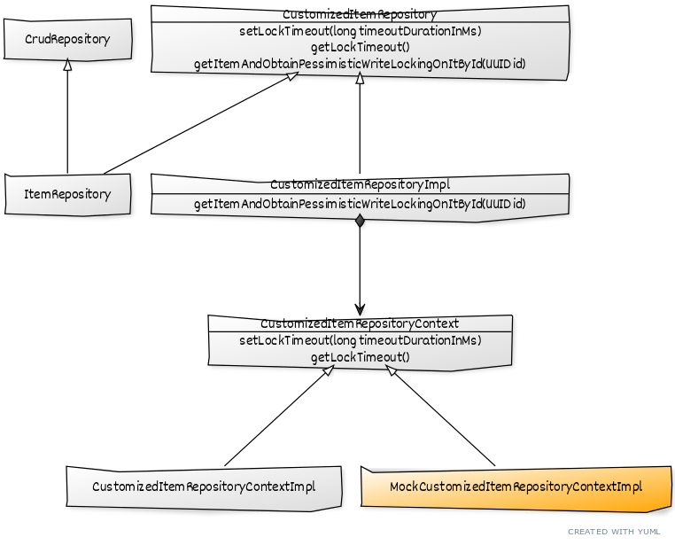

# Pessimistic Locking

## Diagram



## Implementation

### Item Repository

An interface that extends CrudRepository.

### CustomizedItemRepository

- To implement the pessimistic locking related queries manually
- Accessible through ItemRepository
- setLockTimeout: allows setting LockTimeout for the current query
- getLockTimeout: allows reading the LockTimeout, set for the current query
- getItemAndObtainPessimisticWriteLockingOnItById:
    - implements a custom query, which will be executed with the LockTimeout set by setLockTimeout method
- CustomizedItemRepositoryContextImpl
    - contains a custom implementation for the production database;
- MockCustomizedItemRepositoryContextImpl
    - contains a custom implementation for the in-memory Apache Derby database, used in the test environment only.

## Native LockTimeout Support by Different Providers

| LockTimeout         | Oracle    | MySQL                  | PostgreSQL    | H2            | Apache Derby           |
|---------------------|-----------|------------------------|---------------|---------------|------------------------|
| unit of measurement | sec       | sec                    | ms            | ms            | sec                    |
| nowait (or similar) | 0         | 0                      | 1             | 1             | 0                      |
| min                 | 0         | 0                      | 1             | 1             | 0                      |
| max                 | 2.147.483 | oo (no internal limit) | 2.147.483.647 | 2.147.483.647 | oo (no internal limit) |
| infinite wait       | -1        | N/A                    | 0             | N/A           | N/A                    |
| default             | -1        | 50                     | 0             | 4000          | 60                     |

> As you see in the table, not setting LockTimeout for a pessimistic locking could cause resource exhaustion for your
> production system: Some databases, like Oracle and PostgreSQL, have a LockTimeout of infinite!

> As you notice there are many differences between different vendors: the meaning of -1 and 0, the different min
> values, the different measure units!

## Comparison Between Different RDBMS Parameters In The Solution

| parameter                                               | Oracle | MySQL | PostgreSQL | Apache Derby |
|---------------------------------------------------------|--------|-------|------------|--------------|
| requiredToSetLockTimeoutForTestsAtStartup               | false  | false | false      | true         |
| requiredToSetLockTimeoutForEveryQuery                   | false  | true  | true       | false        |
| requiredToSetLockTimeoutQueryHint                       | true   | false | false      | false        |
| delayAtTheEndOfTheQueryForPessimisticLockingTestingInMs | 200    | 2000  | 0          | 0            |
| minimalPossibleLockTimeOutInMs                          | 0      | 1000  | 1          | 0            |
| lockTimeOutInMsForQueryGetItem                          | 5000   | 5000  | 5000       | 5000         |

## Setting LockTimeout for Oracle

### Set LockTimeout through JPA query in Spring Repository:

```
@Lock(LockModeType.PESSIMISTIC_WRITE)
@QueryHints({@QueryHint(name = "javax.persistence.lock.timeout", value = "3000")})
Optional<Item> getItemById(UUID id);
```

> This jpa query will try to acquire a pessimistic lock with LockTimeout set to 3 seconds (3000 ms).

> As you see Oracle has great jpa support for setting LockTimeout. No native code needed!

## Setting LockTimeout for PostgreSQL

### Get LockTimeout:

```show lock_timeout```

### Set LockTimeout:

```set local lock_timeout = 3000```

> This native query takes effect for the current transaction only.

> You could now acquire a pessimistic lock through jpa query, and it will set LockTimeout to 3 seconds (3000 ms).

## Setting LockTimeout for Apache Derby

### Get LockTimeout:

```VALUES SYSCS_UTIL.SYSCS_GET_DATABASE_PROPERTY('derby.locks.waitTimeout')```

### Set LockTimeout:

```CALL SYSCS_UTIL.SYSCS_SET_DATABASE_PROPERTY('derby.locks.waitTimeout',  '3')```

> This native query will set the default LockTimeout to 3 seconds (3000 ms).

> Execute this native query at start-up only and within dedicate transaction. It will take effect in the subsequent
> transactions only.

## Copied From

- [Handling Pessimistic Locking with JPA on Oracle, MySQL, PostgreSQL, Apache Derby and H2](https://blog.mimacom.com/handling-pessimistic-locking-jpa-oracle-mysql-postgresql-derbi-h2/)
- [Testing Pessimistic Locking Handling with Spring Boot and JPA](https://blog.mimacom.com/testing-pessimistic-locking-handling-spring-boot-jpa/)