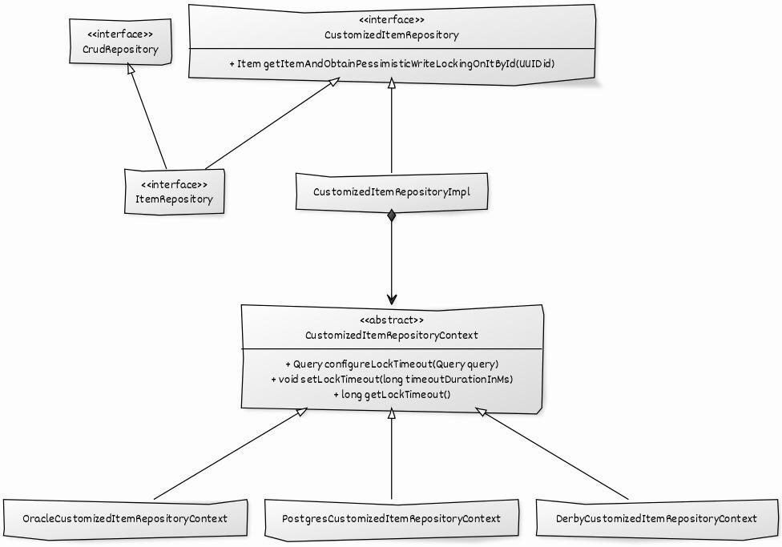

# Pessimistic Locking

## UML Diagram Of The Solution



## JPA Pessimistic Locking Support By Different Providers

| jpa feature                               | Oracle | PostgreSQL | Apache Derby |
|-------------------------------------------|--------|------------|--------------|
| LockModeType.PESSIMISTIC_WRITE            | x      | x          | x            |
| javax.persistence.lock.timeout            | x      |            |              |
| javax.persistence.lock.timeout=0 (nowait) | x      |            |              |
| handling of LockTimeoutException          | x      | x          | x            |

> Jpa support for LockTimeout by different providers listed in the table is not that great.

> Only Oracle has a full jpa support

> PostgreSQL has a support for nowait only

## Native LockTimeout Support by Different Providers

| LockTimeout         | Oracle    | PostgreSQL    | Apache Derby           |
|---------------------|-----------|---------------|------------------------|
| unit of measurement | sec       | ms            | sec                    |
| nowait (or similar) | 0         | 1             | 0                      |
| min                 | 0         | 1             | 0                      |
| max                 | 2.147.483 | 2.147.483.647 | oo (no internal limit) |
| infinite wait       | -1        | 0             | N/A                    |
| default             | -1        | 0             | 60                     |

> As shown in the table, not setting LockTimeout for a pessimistic locking could cause resource exhaustion for
> production system: Some databases, like Oracle and PostgreSQL, have a LockTimeout of infinite!

> There are many differences between different vendors: the meaning of -1 and 0, the different min
> values, the different measure units!

## Setting LockTimeout for Oracle

### Set LockTimeout through JPA query in Spring Repository:

```
@Lock(LockModeType.PESSIMISTIC_WRITE)
@QueryHints({@QueryHint(name = "javax.persistence.lock.timeout", value = "3000")})
Optional<Item> getItemById(UUID id);
```

> This jpa query will try to acquire a pessimistic lock with LockTimeout set to 3 seconds (3000 ms).

> Oracle has great jpa support for setting LockTimeout. No native code needed!

## Setting LockTimeout for PostgreSQL

### Get LockTimeout:

```show lock_timeout```

### Set LockTimeout:

```set local lock_timeout = 3000```

> This native query takes effect for the current transaction only.

> We could now acquire a pessimistic lock through jpa query, and it will set LockTimeout to 3 seconds (3000 ms).

## Setting LockTimeout for Apache Derby

### Get LockTimeout:

```VALUES SYSCS_UTIL.SYSCS_GET_DATABASE_PROPERTY('derby.locks.waitTimeout')```

### Set LockTimeout:

```CALL SYSCS_UTIL.SYSCS_SET_DATABASE_PROPERTY('derby.locks.waitTimeout',  '3')```

> This native query will set the default LockTimeout to 3 seconds (3000 ms).

> Execute this native query at start-up only and within dedicate transaction. It will take effect in the subsequent
> transactions only.

## Reference

- [Handling Pessimistic Locking with JPA on Oracle, MySQL, PostgreSQL, Apache Derby and H2](https://blog.mimacom.com/handling-pessimistic-locking-jpa-oracle-mysql-postgresql-derbi-h2/)
- [Testing Pessimistic Locking Handling with Spring Boot and JPA](https://blog.mimacom.com/testing-pessimistic-locking-handling-spring-boot-jpa/)